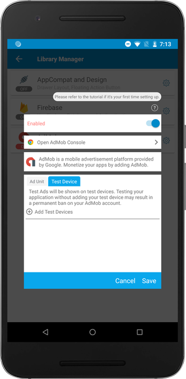

You need to make sure that your device is registered as a Test Device. **If you do not add your Test Device ID and profit from your own apps, your account could result in a ban on your AdMob account.**

## Navigate to AdMob Settings

Inside Sketchware, navigate to AdMob library settings under the Library Manager.

Click on the `Test Device` tab. Then, click on `Add Test Devices` button.

Make sure to repeat this step for all the devices you test on.
