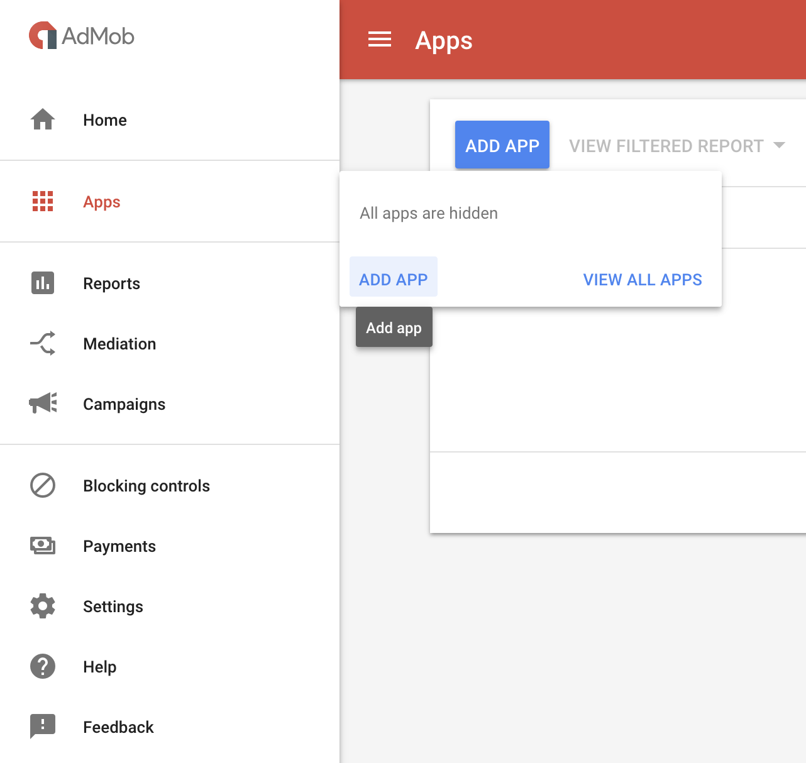
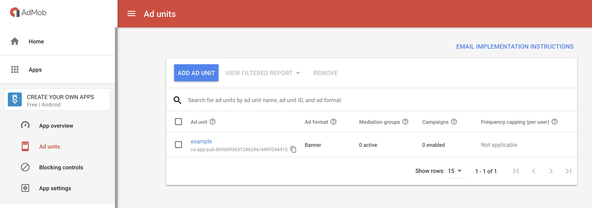
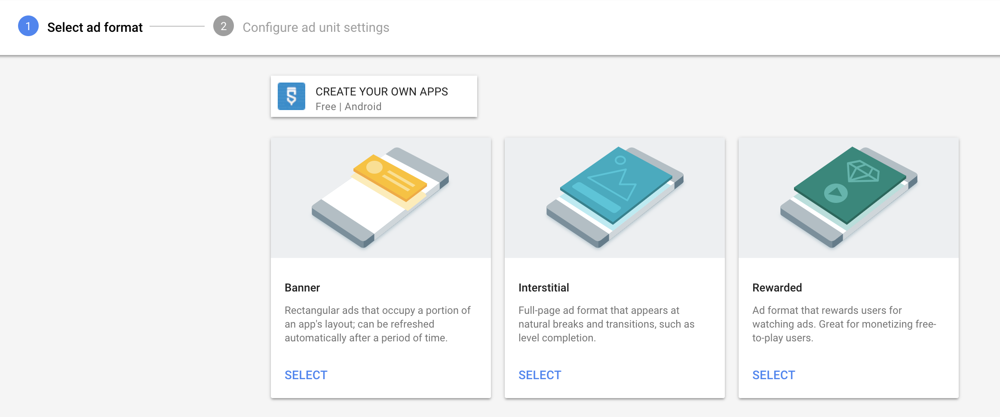
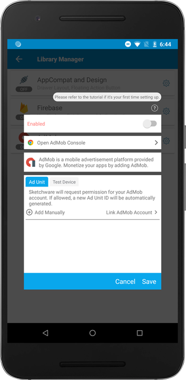
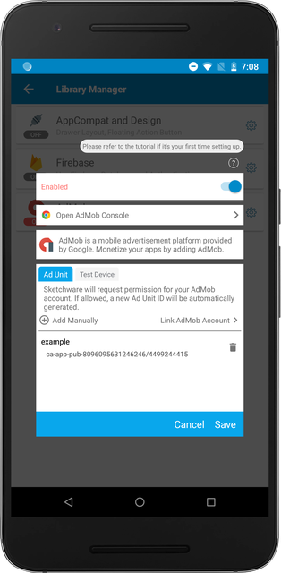

An ad unit is one or more Google ads displayed as a result of one piece of the AdSense ad code. You need to generate a Ad Unit to show ads inside your application. This is the breakdown of this guide:

1.  Create an Ad Unit inside your AdMob account.
2.  Add Ad Unit ID inside Sketchware.

## Creating Ad Units

Under your AdMob console, click on `Apps` and click on `Add App`. Follow the guide to add the app.

Click on `Ad Units` tab. Then, click on the `ADD AD UNIT` button.

Here, you can create different Ad Units with various formats. When you create a new Ad Unit, please note that Sketchware currently does not support Rewarded ad format.

## Linking Ad Unit IDs in Sketchware

Inside Sketchware, navigate to the Library Manager under your project. Open AdMob settings by clicking on the AdMob item.

Then, click on `Link AdMob Account` button and choose the email you used to set up the AdMob account. This will scrape all the available Ad Units from your AdMob account into Sketchware. You can also manually add them by clicking on `Add Manually` button.

If you see that your Ad Unit ID, you're all set!
