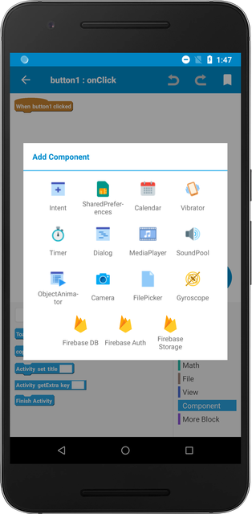

Components are extra functionalities you can add in your app. For example, you can let the users take pictures in your application by adding the `Camera` Component.

After you add a Component, you will gain access to the necessary blocks to use the Component. Note that the Component blocks are only added after you add a new Component.

You can either add Components in the `Component` tab, or inside the event.

More information about individual Component can be found [here](component-intent)
