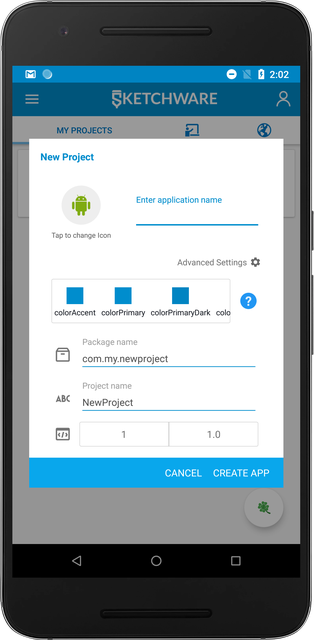

## Landing Screen

When you first Start Sketchware, you start on `My Projects` tab. Click on `Create A New Project` button, and give Sketchware permissions to read and write to storage.

## Project Configuration

You only need to set the **name** for your application. Here is a full list of the settings you can change:

1.  `Icon` - Tap on the Android Icon to change the icon for your application.
2.  `Application Name` - Name of the application.
3.  `Theme` - Default colors for the status bar, buttons, and more.
4.  `Package Name` - A unique identifier for your application.
5.  `Project Name` - A Project Name, which is different than Application Name, used to identify the project.
6.  `Version Code` - Version of your application. Should always be incremented when releasing a new update.

## Creating a New Project

After filling out the necessary information, click on `Create` to create a new project.
