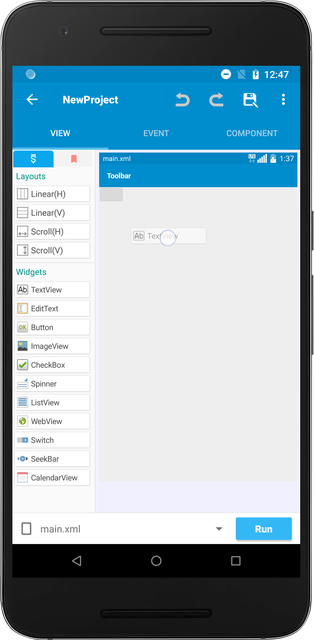
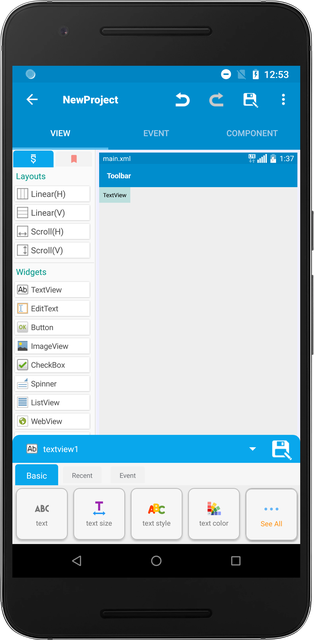
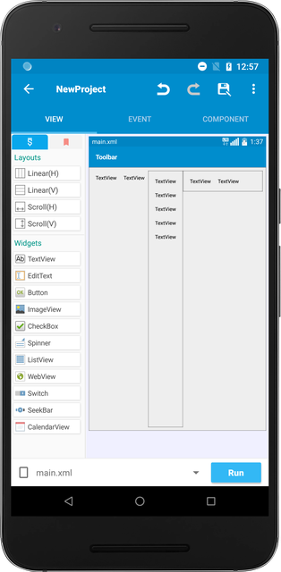

You can design how your application looks like by working on the `View` tab.

In order to gain expertise in designing your application, you need to understand three different topics: Widgets, Properties, and Layouts.

## Widgets

Widgets are a collection of different functionalities that serve different purposes. For example, a `TextView` is a widget that shows text value on the screen, and an `ImageView` is a widget that renders an image. To place the widgets, simply long-press them and drop it on the edit screen.

## Properties

Each widget comes with different properties. For example, a `TextView` will come with properties like `text size` and `text color`, and an `ImageView` will come with the `image` property. These properties can be found on the bottom after you place a widget.

## Layouts

By default, widgets are placed vertically on the screen. By mixing differently oriented layouts, you can change the way widgets are placed on the screen.

You can place widgets horizontally inside the Linear(H) layout and vertically inside the Linear(V) layout.

