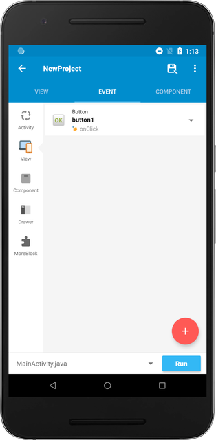
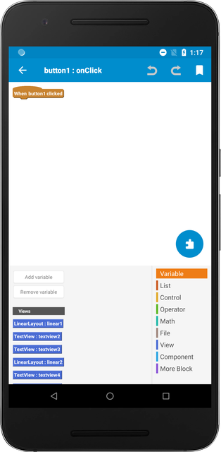

## Events

After you design your application, you can make your application functional using the `Event` tab.

There are many events occurred in an application. For example, there are user driven events such as a button click, and there are native Android lifecycle events such as app being started or closed.

In Sketchware, you program inside these events to make your application responsive and functional.

Try adding a `Button` widget in the `View` tab, and go to the `Event` tab. You will see that the Button's onClick event has been added.

Click on the event.

## Logic

Inside the event, you will be able to program using lego-like blocks. There are different categories of blocks you could use.

### Variable

You can store values inside variables. Variables hold value that may be varied or changed in the future. For example, you can store and read a String (text) value, numbers, or a collection of pairs using variables.

### List

List is a collection of variables. Similarly, you can create a list of String variables, numbers, or a collection of pairs.

### Control

Control blocks are used to conditionally change how the app behaves. For example, you should use the if-else block to make the screen only change when the login values are correct.

### Operator

Operator tab includes blocks that are more utility based. For example, you will find blocks that let you multiply, concatenate String values, change number to String, etc.

### Math

Math blocks are heavily focused on mathematical operations.

### File

File blocks let you read and write files from and to a specific path.

### View

View blocks let you manipulate widgets on runtime. You can hide widgets, change the background color, etc.

### Component

Component blocks will be covered in [Adding Components](basic-component).

### More Block

More Block is used to create your own block. For repetitive tasks, you can create a More Block that does the task and then use the block to program more efficiently.
