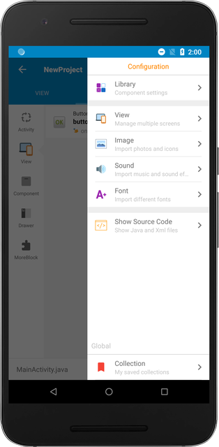

You can add Images, Sounds, and Fonts for your application using resource managers.

The managers are located in the right drawer, which can be accessed by clicking on the menu option located in the right top corner.

