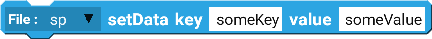

## Example

Using setData block to save a value of `someValue` with the key `someKey`.

 

--------------------

# Blocks

## getData

getData is used to retrieve the saved data.

| Type              | Explanation                                 | Required |
| ----------------- | ------------------------------------------- | -------- |
| Shared Preference | Shared Preference Component                 | Yes      |
| String            | Key of the value you are trying to retrieve | Yes      |