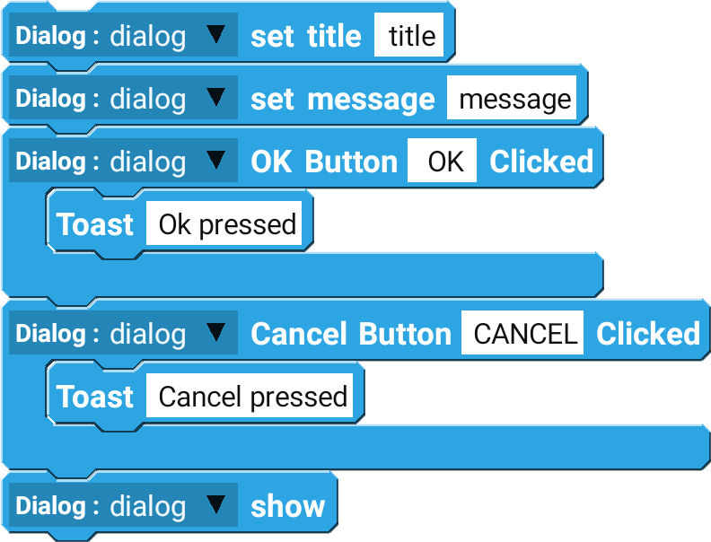

## Example

Create and show a dialog with the title `title` and message `message` with OK and Cancel button.

 

--------------------

# Blocks

## setTitle

setTitle is used to set the title of the dialog. 

| Type              | Explanation                                 | Required |
| ----------------- | ------------------------------------------- | -------- |
| Shared Preference | Shared Preference Component                 | Yes      |
| String            | Key of the value you are trying to retrieve | Yes      |