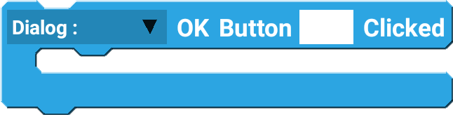
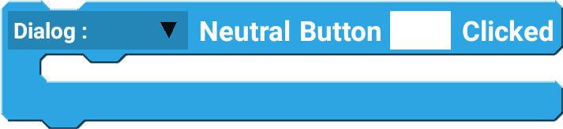

Dialog is a popup that is often used to confirm user's action.

## Example

Create and show a dialog with the `title` and `message` with OK and Cancel button.

 

--------------------

## Blocks

### setTitle

Set the title of the dialog. 

| Type   | Explanation         | Required |
| ------ | ------------------- | -------- |
| Dialog | Dialog Component    | Yes      |
| String | Title of the dialog | Yes      |

### setMessage

Set the message of the dialog. 

| Type   | Explanation           | Required |
| ------ | --------------------- | -------- |
| Dialog | Dialog Component      | Yes      |
| String | Message of the dialog | Yes      |

### OK Button Clicked

Add an OK button, and determine the action to perform when clicked.

| Type   | Explanation           | Required |
| ------ | --------------------- | -------- |
| Dialog | Dialog Component      | Yes      |
| String | Text of the OK Button | Yes      |

### Cancel Button Clicked

Add a Cancel button, and determine the action to perform when clicked.

| Type   | Explanation               | Required |
| ------ | ------------------------- | -------- |
| Dialog | Dialog Component          | Yes      |
| String | Text of the Cancel Button | Yes      |

### Neutral Button Clicked

Add a Neutral button, and determine the action to perform when clicked.

| Type   | Explanation                | Required |
| ------ | -------------------------- | -------- |
| Dialog | Dialog Component           | Yes      |
| String | Text of the Neutral Button | Yes      |

### Show

Show the created dialog. Note that the dialog will not show without this block.

| Type   | Explanation      | Required |
| ------ | ---------------- | -------- |
| Dialog | Dialog Component | Yes      |

