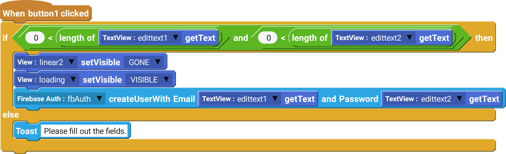

Firebase Auth component is used to authenticate users. It also ensures that users are only accessible to certain data.

## Examples and uses

- Creating a new user with given username and password.
- Logging in an existing user
- Making sure users recevive the correct infomation

 

--------------------

## Blocks

### create user with email and password

The 'create user with email and password' block creates a new user on the Firebase database using the E-mail and password given by the user.

| Type          | Explanation                      | Required |
| ------------- | -------------------------------- | -------- |
| Firebase Auth | Targeted Firebase Auth component | Yes      |
| String        | User E-mail                      | Yes      |
| String        | User password                    | Yes      |

### sign in user with email and password

The 'sign in user with email and password' block signs the user in the app by checking against the Firebase database.

| Type          | Explanation                      | Required |
| ------------- | -------------------------------- | -------- |
| Firebase Auth | Targeted Firebase Auth component | Yes      |
| String        | User E-mail                      | Yes      |
| String        | User password                    | Yes      |

### sign in anonymously

The 'sign in anonymously' block signs in the user without any login infomation or registration needed.

| Type          | Explanation                      | Required |
| ------------- | -------------------------------- | -------- |
| Firebase Auth | Targeted Firebase Auth component | Yes      |

### is logged in

The 'is logged in' boolean will return a True if the user has been authenticated via Firebase, otherwise it will return a False.

### get email

The 'get email' block retrieves the e-mail address of the current user.

### get Uid

The 'get Uid' block retrieves the unique identification (Uid) of the current user.

### send password reset email to

The 'send password reset email to' block sends a password reset e-mail to the given e-mail address.

| Type          | Explanation                      | Required |
| ------------- | -------------------------------- | -------- |
| Firebase Auth | Targeted Firebase Auth component | Yes      |
| String        | Email address                    | Yes      |

### sign out

The 'sign out' block logs the user out from the app and deletes its infomation from the app data

## Events

### onCreateUserComplete

The 'onCreateUserComplete' event triggers when Firebase auth finishes attampting to create a new user in the database.
**Success (Boolean)** - Tells whether the user creation was successful. True if the user was created successfully, otherwise False
**errorMessage (String)** - The error message can be retrived here if the user creation was not successful.

### onLogInUserComplete

The 'onLogInUserComplete' event triggers when Firebase auth finishes attampting to log in an user using the database.
**Success (Boolean)** - Tells whether the user log-in was successful. True if the user was created successfully, otherwise False
**errorMessage (String)** - The error message can be retrived here if the user log-in was not successful.
### onResetPasswordEmailSent

The 'onResetPasswordEmailSent' event triggers when a password reset E-Mail has been sent to the selected E-mail address.