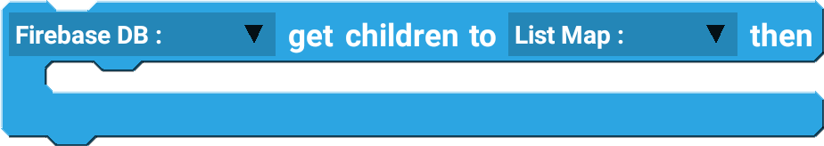

Firebase DB is an online, real-time database used to store and read data. 

## Example

Creating and saving a post information on Firebase Database.

 

--------------------

## Blocks

### add key value

Add data to Firebase Database with key-value format.

| Type              | Explanation                             | Required |
| ----------------- | --------------------------------------- | -------- |
| Firebase Database | Firebase Database Component             | Yes      |
| String            | Key of the value you are trying to save | Yes      |
| Map               | Map of values                           | Yes      |

### push value

Push data to Firebase Database with a generated unique random key.

| Type              | Explanation                 | Required |
| ----------------- | --------------------------- | -------- |
| Firebase Database | Firebase Database Component | Yes      |
| Map               | Map of values               | Yes      |

### push getKey

Generate a unique random key.

| Type              | Explanation                 | Required |
| ----------------- | --------------------------- | -------- |
| Firebase Database | Firebase Database Component | Yes      |

### delete key

Delete the data from the Databse with the given key.

| Type              | Explanation                               | Required |
| ----------------- | ----------------------------------------- | -------- |
| Firebase Database | Firebase Database Component               | Yes      |
| String            | Key of the value you are trying to delete | Yes      |

### get children to then

Retrieve the value to List Map, then perform additional action.

| Type              | Explanation                 | Required |
| ----------------- | --------------------------- | -------- |
| Firebase Database | Firebase Database Component | Yes      |
| List Map          | List Map variable           | Yes      |

### start listening

Start listening to changes in the database. The component starts listening by default. Only used after stopping the listener.

| Type              | Explanation                 | Required |
| ----------------- | --------------------------- | -------- |
| Firebase Database | Firebase Database Component | Yes      |

### stop listening

Stop listening to the changes in the database.

| Type              | Explanation                 | Required |
| ----------------- | --------------------------- | -------- |
| Firebase Database | Firebase Database Component | Yes      |

## Events

### onChildAdded

Triggered when a new child value is added.

### onChildChnaged

Triggered when any value in children has changed.

### onChildRemoved

Triggered when a child is removed from reference.

### onCancelled

Triggered when any read or write action is cancelled.