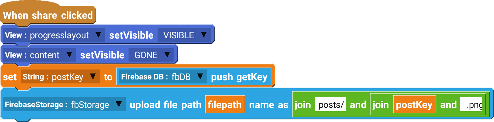

Firebase Storage component is used to save and download files from an online storage.

## Example

Uploading an image file after using Camera component to take a picture.

 

--------------------

## Blocks

### upload file

Upload file to path with the given name.

| Type             | Explanation                     | Required |
| ---------------- | ------------------------------- | -------- |
| Firebase Storage | Firebase Storage Component      | Yes      |
| String           | Path to the file to be uploaded | Yes      |
| String           | Name to save the file as        | Yes      |

### download file

Download file from url to given path.

| Type             | Explanation                | Required |
| ---------------- | -------------------------- | -------- |
| Firebase Storage | Firebase Storage Component | Yes      |
| String           | URL of the file            | Yes      |
| String           | Path to save the file to   | Yes      |

### delete file

Delete file at the given Firebase Storage URL.

| Type             | Explanation                         | Required |
| ---------------- | ----------------------------------- | -------- |
| Firebase Storage | Firebase Storage Component          | Yes      |
| String           | URL of the file in Firebase Storage | Yes      |

## Events

### onFailure

Triggered when the file failed to upload or download.

### onUploadSuccess

Triggered when the file successfully uploaded.

### onUploadProgress

Triggered when the file starts uploading.

### onDownloadProgress

Triggered when the file starts downloading.

### onDownloadSuccess

Triggered when the file successfully downloaded.

### onDeleteSuccess

Triggered when the file is successfully deleted.