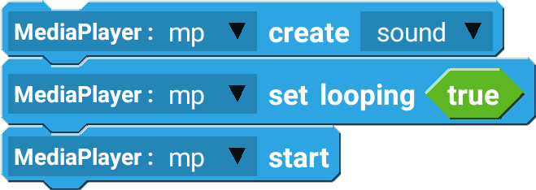

MediaPlayer is used to load and play long sound files.

## Example

Creating a MediaPlayer and playing a sound file on a loop. 

 

--------------------

## Blocks

### create

Create a MediaPlayer with a certain sound file.

| Type        | Explanation           | Required |
| ----------- | --------------------- | -------- |
| MediaPlayer | MediaPlayer Component | Yes      |
| Sound       | Sound file to load    | Yes      |

### start

Play the loaded MediaPlayer.

| Type        | Explanation           | Required |
| ----------- | --------------------- | -------- |
| MediaPlayer | MediaPlayer Component | Yes      |

### pause

Pause the playing MediaPlayer.

| Type        | Explanation           | Required |
| ----------- | --------------------- | -------- |
| MediaPlayer | MediaPlayer Component | Yes      |

### seek to

Change the position of the MediaPlayer.

| Type        | Explanation                      | Required |
| ----------- | -------------------------------- | -------- |
| MediaPlayer | MediaPlayer Component            | Yes      |
| Number      | Time to seek to, in milliseconds | Yes      |

### get current duration

Get the current position of the MediaPlayer, in milliseconds.

| Type        | Explanation           | Required |
| ----------- | --------------------- | -------- |
| MediaPlayer | MediaPlayer Component | Yes      |

### get song duration

Get the entire length of the sound file, in milliseconds.

| Type        | Explanation           | Required |
| ----------- | --------------------- | -------- |
| MediaPlayer | MediaPlayer Component | Yes      |

### is playing

Check if the media player is currently playing.

| Type        | Explanation           | Required |
| ----------- | --------------------- | -------- |
| MediaPlayer | MediaPlayer Component | Yes      |

### set looping

Loop the MediaPlayer if true.

| Type        | Explanation           | Required |
| ----------- | --------------------- | -------- |
| MediaPlayer | MediaPlayer Component | Yes      |
| Boolean     | true or false value   | Yes      |

### is looping

Check if the MediaPlayer is currently in a looping state.

| Type        | Explanation           | Required |
| ----------- | --------------------- | -------- |
| MediaPlayer | MediaPlayer Component | Yes      |

### reset

Reset the current position to 0.

| Type        | Explanation           | Required |
| ----------- | --------------------- | -------- |
| MediaPlayer | MediaPlayer Component | Yes      |

### release

Release the connected sound file to the MediaPlayer. If released, you have to recreate the MediaPlayer.

| Type        | Explanation           | Required |
| ----------- | --------------------- | -------- |
| MediaPlayer | MediaPlayer Component | Yes      |

