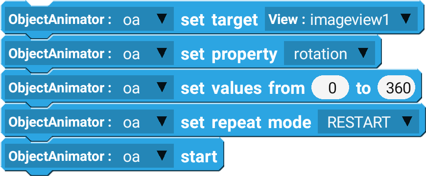
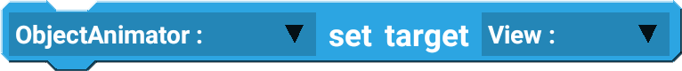
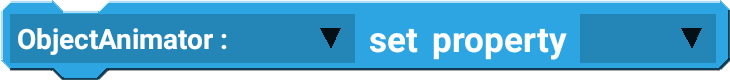
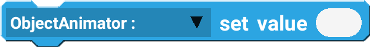
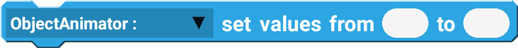
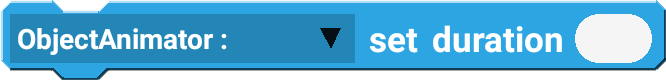
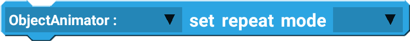
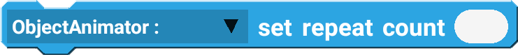
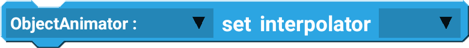
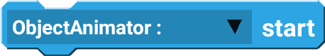

ObjectAnimator component is used to **animate widgets**. 

## Example

Rotating an image to create a loading icon.

 

--------------------

## Blocks

### set target

Set the view to animate.

| Type           | Explanation              | Required |
| -------------- | ------------------------ | -------- |
| ObjectAnimator | ObjectAnimator Component | Yes      |
| View           | View to animate          | Yes      |

### set property

Set the property to animate.

| Type           | Explanation                                                             | Required |
| -------------- | ----------------------------------------------------------------------- | -------- |
| ObjectAnimator | ObjectAnimator Component                                                | Yes      |
| Property       | Properties: rotation, translationX, translationY, alpha, scaleX, scaleY | Yes      |

### set value

Set the value to animate to.

| Type           | Explanation              | Required |
| -------------- | ------------------------ | -------- |
| ObjectAnimator | ObjectAnimator Component | Yes      |
| Number         | Value to animate to      | No       |

### set values from to

Set the value to animate from and to.

| Type           | Explanation              | Required |
| -------------- | ------------------------ | -------- |
| ObjectAnimator | ObjectAnimator Component | Yes      |
| Number         | Value to animate from    | No       |
| Number         | Value to animate to      | No       |

### set duration

Set the duration for the animation.

| Type           | Explanation               | Required |
| -------------- | ------------------------- | -------- |
| ObjectAnimator | ObjectAnimator Component  | Yes      |
| Number         | Duration of the animation | No       |

### set repeat mode

Two different repeat modes:

1. `RESTART` - restarts the animation from beginning again when it is finished.
2. `REVERSE` - restarts the animation from end to beginning when it is finished.

| Type           | Explanation              | Required |
| -------------- | ------------------------ | -------- |
| ObjectAnimator | ObjectAnimator Component | Yes      |
| Repeat Mode    | Modes: RESTART, REVERSE  | Yes      |

### set repeat count

Set the number of times the animation should repeat.

| Type           | Explanation                             | Required |
| -------------- | --------------------------------------- | -------- |
| ObjectAnimator | ObjectAnimator Component                | Yes      |
| Number         | Number of times to repeat the animation | No       |

### set interpolator

Set the interpolator for the animation, which affects the way animation behaves. 

| Type           | Explanation                                                                 | Required |
| -------------- | --------------------------------------------------------------------------- | -------- |
| ObjectAnimator | ObjectAnimator Component                                                    | Yes      |
| Interpolator   | Interpolators: Linear, Accelerate, Decelerate, AccelerateDecelerate, Bounce | Yes      |

### start

Start the animation.

| Type           | Explanation              | Required |
| -------------- | ------------------------ | -------- |
| ObjectAnimator | ObjectAnimator Component | Yes      |

### cancel

Cancel the animation.

| Type           | Explanation              | Required |
| -------------- | ------------------------ | -------- |
| ObjectAnimator | ObjectAnimator Component | Yes      |

### is running

True if animation is currently running.

| Type           | Explanation              | Required |
| -------------- | ------------------------ | -------- |
| ObjectAnimator | ObjectAnimator Component | Yes      |

## Events

### onAnimationStart

Triggered when animation starts.

### onAnimationEnd

Triggered when animation finishes.

### onAnimationCancel

Triggered when animation is cancelled.
