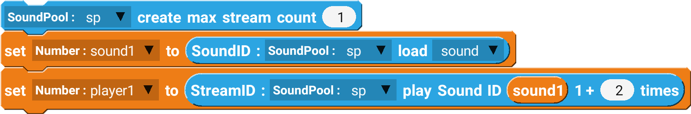

Unlike SoundPool, SoundPool is used to play short sounds, such as sound effects.

## Example

Loading a single sound effect and playing it.

 

--------------------

## Blocks

### create max stream count

Create a SoundPool instance with maximum number of sounds it can hold.

| Type        | Explanation           | Required |
| ----------- | --------------------- | -------- |
| SoundPool   | SoundPool Component   | Yes      |
| Sound       | Sound file to load    | Yes      |

### SoundID load

Load a sound file and set a number variable.

| Type        | Explanation           | Required |
| ----------- | --------------------- | -------- |
| SoundPool   | SoundPool Component   | Yes      |
| Sound       | Sound file to load    | Yes      |

### play Sound ID

Play the sound file with the matching Sound ID.

| Type        | Explanation           | Required |
| ----------- | --------------------- | -------- |
| SoundPool   | SoundPool Component   | Yes      |
| Sound       | Sound file to load    | Yes      |

### stop stream ID

Stop the sound file with the matching Sound ID.

| Type        | Explanation           | Required |
| ----------- | --------------------- | -------- |
| SoundPool   | SoundPool Component   | Yes      |
| Sound       | Sound file to load    | Yes      |
