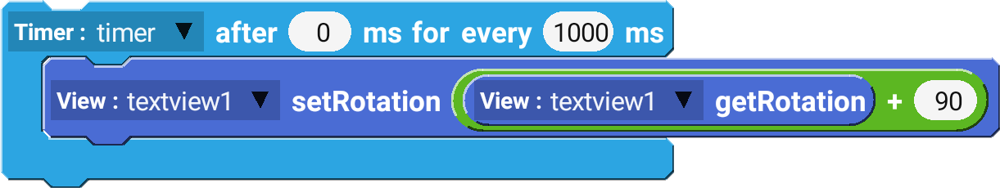
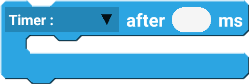
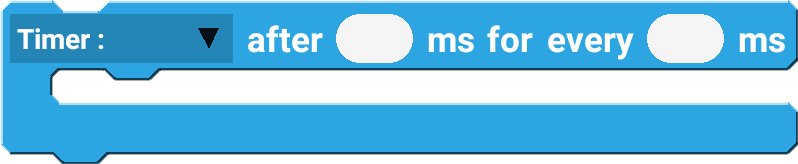

Timer component is used to execute a task after a certain amount of time, or repeat a certain task every set amount of time.

## Example

These blocks will rotate the view `textview1` by 90 degrees every 1 second.

 

--------------------

# Blocks

## after

after block executes the task after set amount of time.

| Type   | Explanation                                           | Required |
| ------ | ----------------------------------------------------- | -------- |
| Timer  | Timer Component                                       | Yes      |
| Number | Amount of time (ms) to wait before executing the task | Yes      |

## after every

after every block executes the task after set amount of time.

| Type   | Explanation                                                 | Required |
| ------ | ----------------------------------------------------------- | -------- |
| Timer  | Timer Component                                             | Yes      |
| Number | Amount of time (ms) to wait before executing the task       | Yes      |
| Number | Amount of time (ms) to wait before executing the task again | Yes      |

## cancel

cancel block cancels the timer task.

| Type  | Explanation     | Required |
| ----- | --------------- | -------- |
| Timer | Timer Component | Yes      |