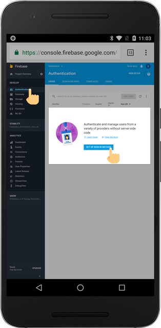
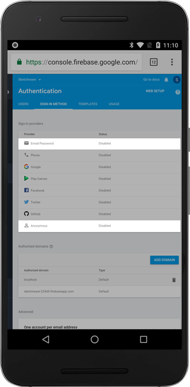

Firebase Auth lets users sign up and login using different credential methods.

## Getting Started

Navigate to Authentication tab under the Develop tab on the left. Then, click on "SET-UP SIGN-IN METHOD" button.

## Enabling Login Methods

Although there are multiple login methods, only e-mail/password and anonymous methods are supported on Sketchware. Click the methods to enable them.

Now, you can use the Firebase Auth component inside Sketchware.
