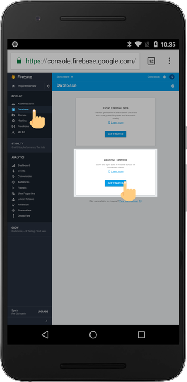
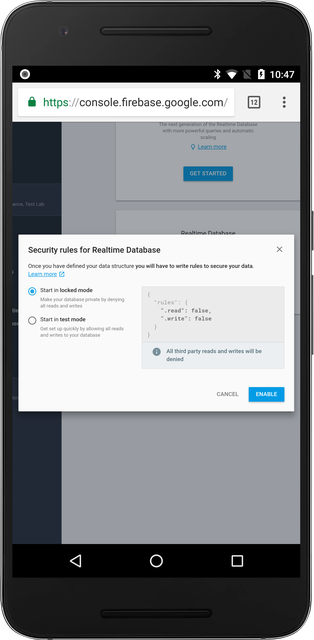

Firebase Database is a realtime database that lets you store and read data online. Using this library, you can manage a shared database all across different apps.

## Getting Started

Navigate to the "Database" tab under the "Develop" section. Then, click on "GET STARTED."

## Locked Mode vs. Test Mode

1.  `Locked Mode` - Locked mode only lets authenticated users write and read to/from the database. This mode is usually only used when the app is ready for production. To use this mode, you should have [Firebase Auth](firebase-auth.md) enabled.

2.  `Test Mode` - If you are still developing your application, you should start in test mode. Test mode lets anyone, with or without authentication, read and write to your database. Although this mode is good for developing and debugging, you should always change to locked mode when you're ready for production.

In order to debug your application, start in "Test Mode." If you're ready for production, refer to the [Firebase Auth](firebase-auth.md) documentation.
