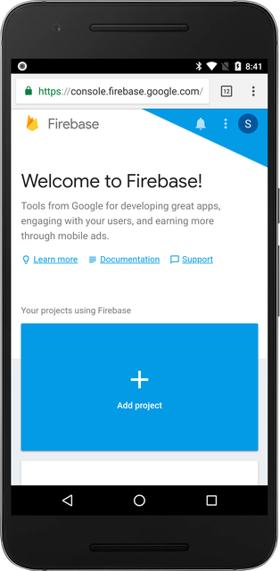
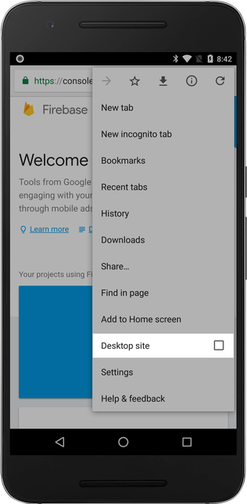
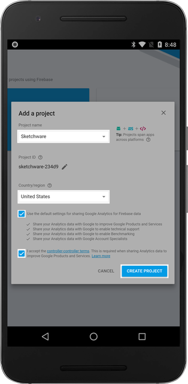
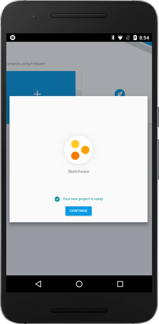

This documentation is intended to help users implement Firebase Component in their Sketchware projects. This documentation will guide you on retrieving the necessary `Project ID`, `App ID`, and `Web API` Key for your projects.

We are going to assume that you are viewing this documentation on a mobile device.

## Creating a Firebase Project

Navigate to https://console.firebase.google.com to create a Firebase Project for your application. Make sure to use [Google Chrome](https://www.google.com/chrome/) Browser for browser compatibility.

## Switching to Desktop Site

To ensure browser compatibility with the website, request to view the website in Desktop mode by pressing the "Desktop site" option under the menu.

## Create a New Project

1.  Click on the "Add project" button as seen below.

2.  Fill out the "Project name" and select an appropriate "Country/region" for your application. Note thta the Project ID is automatically generated for you. After agreeing to the terms, click on the "CREATE PROJECT" button to create your project.

\* _The name does **NOT** have to be "Sketchware." Please name your project appropriately._

3.  After you're done, click on the "Continue" button.

