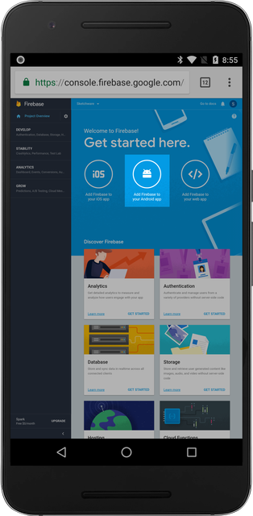
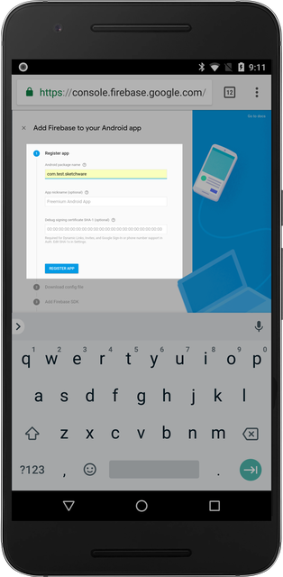
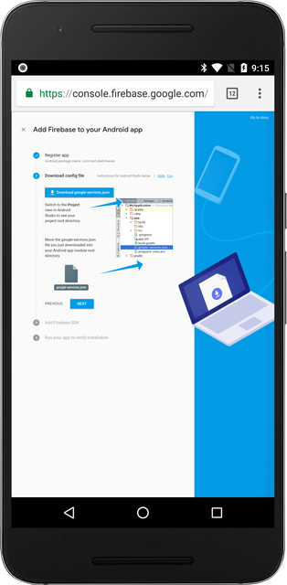
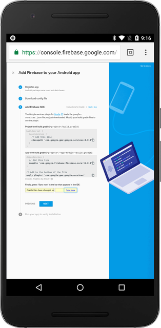
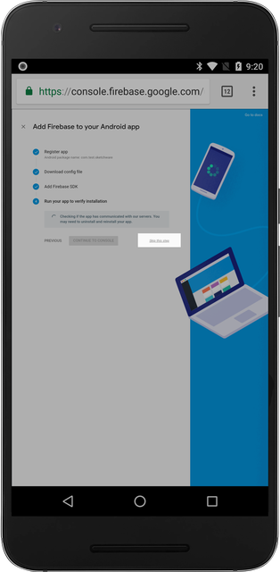

## Add Firebase to your Android App

Click on the "Add Firebase to your Android App" button located in the middle.

## Fill out Application Information

1.  `Android package name` - Fill oout the android package name. This must match the android package name of your Sketchware project.

2.  `App nickname (optional)` - This field is optional.

3.  `Debug signing certificate SHA-1 (optional)` - Skip this field.

After you filled the package name, click on the "REGISTER APP" button.

## Config file and Firebase SDK

The 2nd step and the 3rd can be skipped, as they're not required for Sketchware.

Simply click on the "Next" button for both steps.

|                     Config file                      |                     Firebase SDK                     |
| :--------------------------------------------------: | :--------------------------------------------------: |
|  |  |

## Running your app to verify installation

You can also skip this step.

