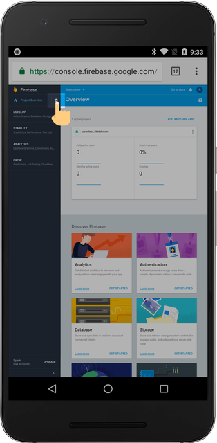
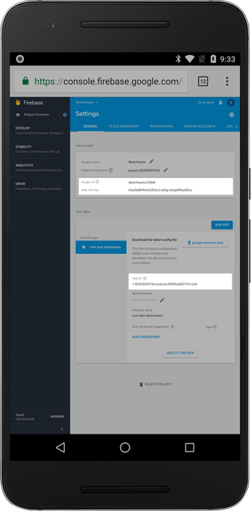

## Navigate to Project Settings

Click on the settings icon located next to "Project Overview"

## Copy Project Settings Information

From the Project Settings screen, you need to copy three items to your clipboard:

1.  Project ID
2.  Web API Key
3.  App ID

Long press the items to copy them to your clipboard.

## Enabling the Firebase Library in Sketchware

Inside your Sketchware project, navgate to the Library Manager located on the top right menu.

After enabling the Firebase library, paste the `Project ID`, `App ID`, and `Web API Key` acquired from the Firebase console.

## You're finished setting up!

To enable realtime database or authentication, please refer to the [Firebase Database](firebase-database.md) and [Firebase Auth](firebase-auth.md) documentations.
