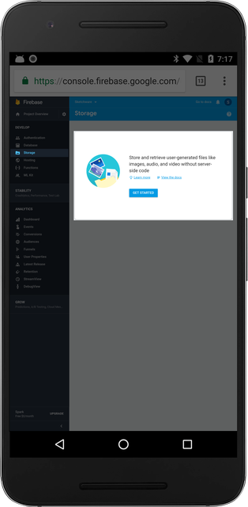
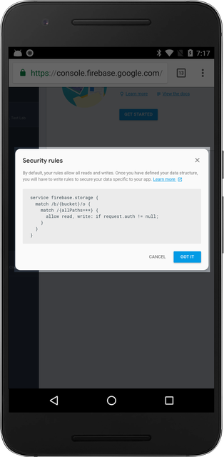
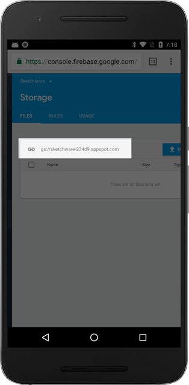

Firebase Storage lets you upload and read raw files to and from the online storage.

## Getting Started

Navigate to the "Storage" tab under the "Develop" section. Then, click on "GET STARTED."

## Basic Security Rules

In debugging mode, like database, storage allows all read and write. When you are ready for production, you should update the rules so that only authorized users can read and write to storage.

## Retrieving the Storage URL

Copy the Storage URL and paste it inside Sketchware's Firebase Library Settings.

