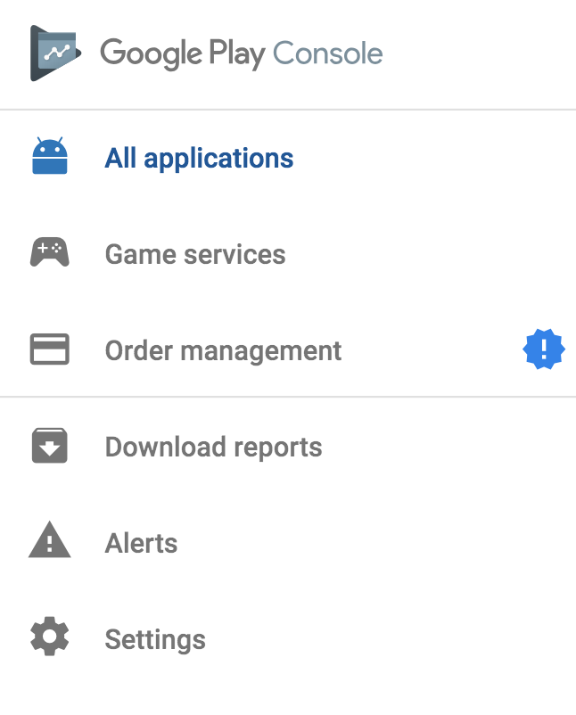
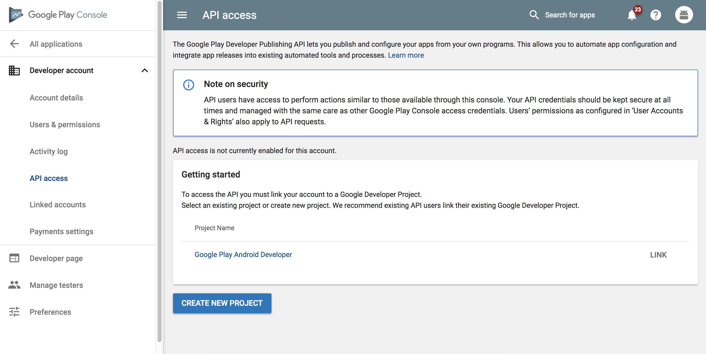
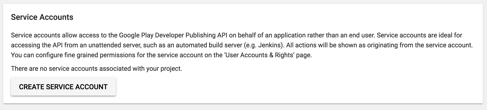
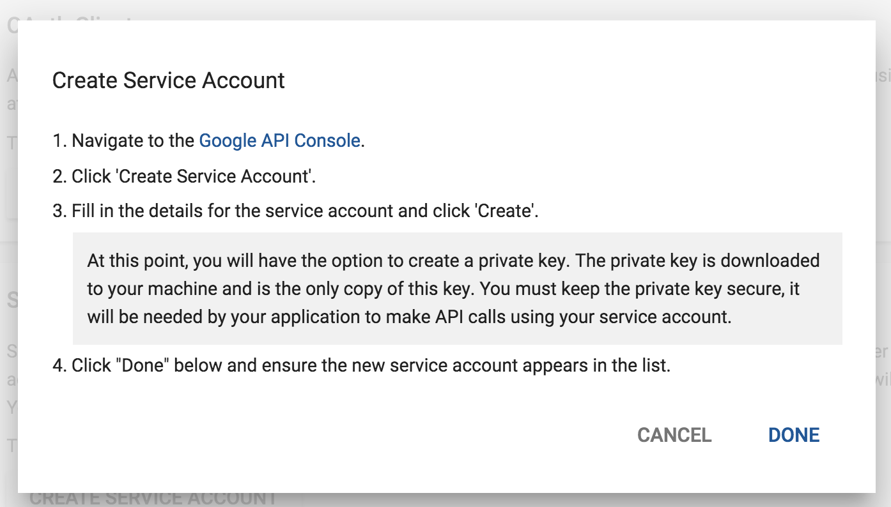
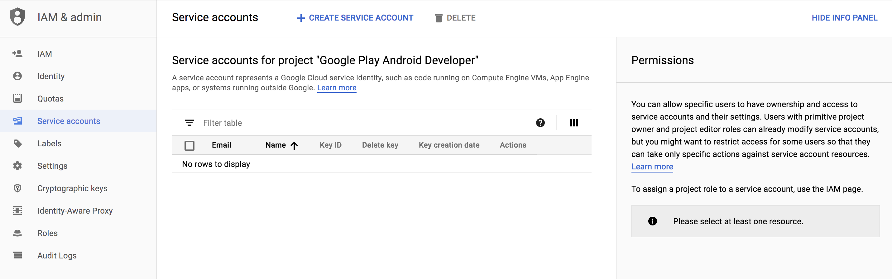
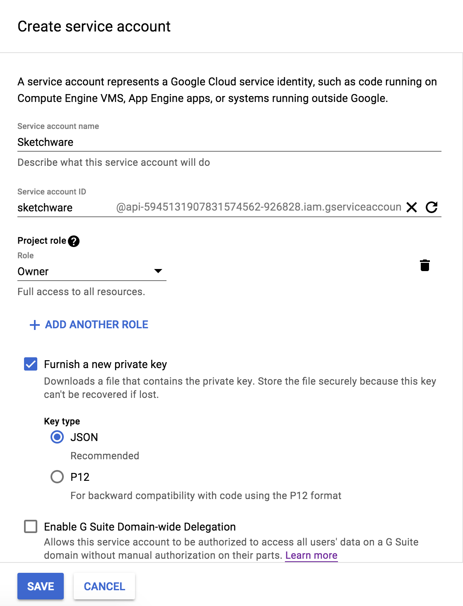
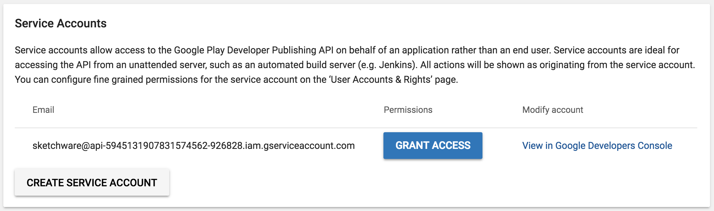
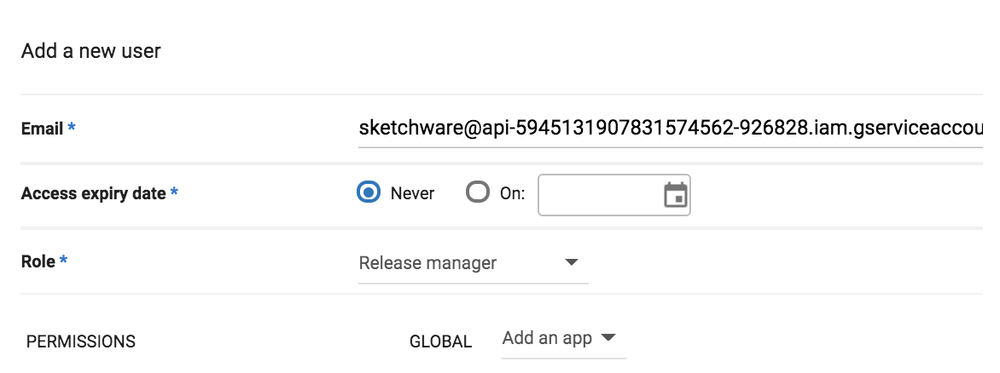

This guide will assist you on creating a service account for Google Play Developer Console. If you do not have a Google Play Developer Account, please follow this [guide](publish-getting-started.md).

## Navigate to Google Play Console

First, navigate to [Google Play Console](https://play.google.com/apps/publish). Then, click on "Settings" located on the left panel.

Under Developer Account -> API Access, click on `CREATE NEW PROJECT` button. This will create a new project, and link the project to your Developer Account.

When the project is linked, click on `CREATE SERVICE ACCOUNT` button located on the bottom of the page.

You will be prompted with the following screen:

Navigate to the given `Google API Console` link. Then, click on `+ CREATE SERVICE ACCOUNT` button located next to "Service accounts."

Fill out the necessary information like below. Make sure that `Furnish a new private key` is checked.

After you click on `Save`, a json file including the service account credential will be saved. **Make sure to store this key securely.**

When you're done, go back to the Google Play Console page, and click on `DONE`.

You will see that a new service account has been added. Click on `GRANT ACCESS`

Grant access to the service account by filling the information like below. Don't change other options. When you're done, click on `ADD USER`.

## Securely Store JSON File

You're all set! Securely store the json file, since you will need it for linking your Play Store Developer account in Sketchware.
