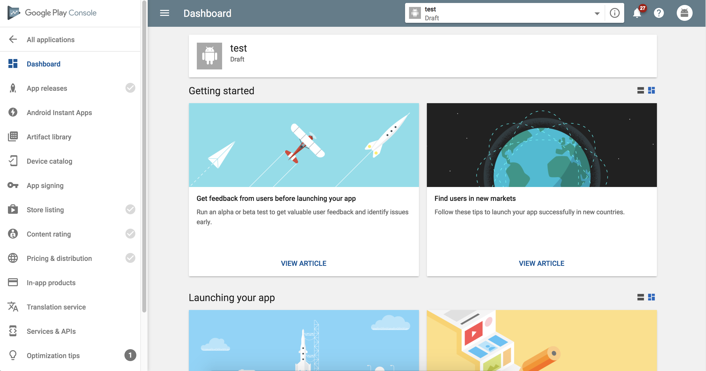
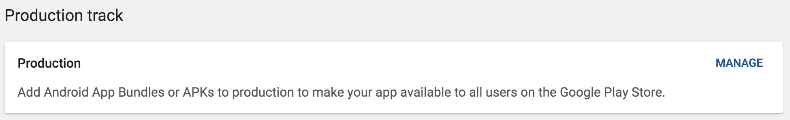
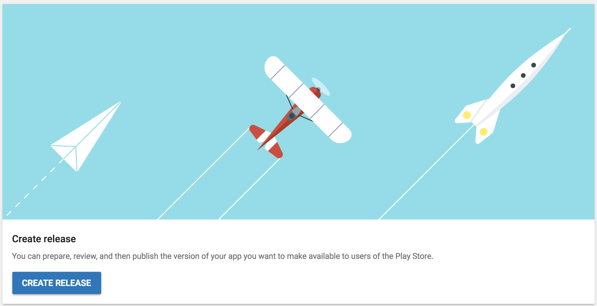

In order to manage your application through Sketchware, you need to manually upload your App to the Play Store (just for the first time).

## Play Console

First, navigate to [Google Play Developer Console](https://play.google.com/apps/publish) and click on the `CREATE APPLICATION` button. Walk through the steps to add a new app. Then, you will see a screen like below.

Here, you need to complete four tasks before you can publish your application:

1.  `App releases` - Manage your app's Android App Bundles, APKs, review release history, and rollout your app to production or testing tracks.
2.  `Store listing` - Manage how your app is going to appear in the Play Store
3.  `Content rating` - Provide accurate responses to the content rating questionnaire. Misrepresentation of your app's content may result in removal or suspension.
4.  `Pricing & distribution` - Choose pricing and target countries.

## App Releases

Inside the App Releases tab, you can upload your APK file with different kinds of release options.

First, you determine your track. There are various tracks:

1.  `Production track` - Add Android App Bundles or APKs to production to make your app available to all users on the Google Play Store.
2.  `Open track` - Add Android App Bundles or APKs to beta to make your app available for open testing.
3.  `Closed track` - Add Android App Bundles or APKs to alpha to make your app available for closed testing.
4.  `Internal track` - The internal test track makes your app available for internal testing within minutes.

For regular publishing, you would normally choose the `Production track`. Click on the `Manage` button by the track you want to release your app on.

On the next screen, click on `CREATE RELEASE`.

### App signing by Google Play

This is optional for you to choose.

### Release name

`Name to identify release in the Play Console only, such as an internal code name or build version.`

This information is not available to the public, so you can choose any name that will help you remember what this release was about.

### What's new in this release?

Enter the release notes for each language within the relevant tags or copy the template for offline editing. Release notes for each language should be within the 500 character limit. You are not required to enter the note for every language.

## Store Listing

Here, you have to provide product details. These information will determine what's going to be shown in the Play Store. Items with asterisks(\*) are required. Provide the necessary information and click on `SAVE DRAFT`.

## Content Rating

You must upload an APK before taking the content rating questionnaire. If you haven't uploaded the APK yet, complete the `App Releases` tab first.

## Pricing & Distribution

You need to acknowledge that this application meets the Content Guidelines and complies with US export laws. Also, you select countries you want to target and answer other questionnaires.
