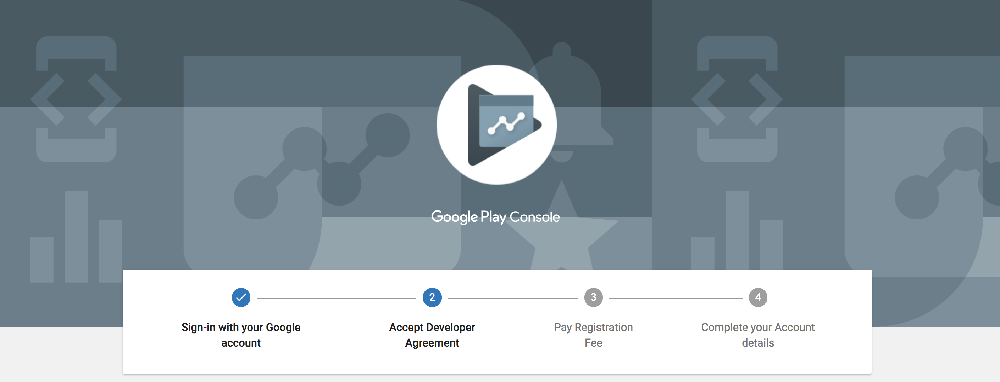

## Google Play Developer Account

In order to publish applications from Sketchware to the Google Play Store, you need a developer's account.

Go to this [link](https://play.google.com/apps/publish/signup/#) and create a Developer account for Google Play. You will need to pay the registration fee of $25.

